# Subscribing to Tweets using Azure Logic Apps
A tutorial for using [Azure Logic Apps](https://azure.microsoft.com/services/logic-apps/) to monitor recent tweets on [Twitter](https://twitter.com). The app sends an email notification to subscribers when new tweets are posted matching a search term.

## Technologies Used
- [Azure Logic Apps](https://azure.microsoft.com/services/logic-apps/) - Manage subscriptions, monitor tweets, and send email notifications to subscribers
- [Azure Table Storage](https://azure.microsoft.com/services/storage/tables/) - Store persistent data like subscriptions

## Prerequisites
- An Azure subscription
  - If you don't have one, [sign up for free](https://azure.microsoft.com/free/).
  - If you're a student, you can [sign up for free](https://azure.microsoft.com/free/students) without requiring a credit card at sign-up.
- An email account (Office 365 or Outlook for all features, Gmail if approval emails are not required)
- A [Twitter](https://twitter.com) account
- A web browser
- [Azure Storage Explorer](https://azure.microsoft.com/features/storage-explorer/) (optional, but recommended for working with Azure Table Storage)

## Create Azure resources
Logics Apps allow you to build and test your application entirely from the Azure Portal using the Logic Apps Designer. Let's get started by creating a few Logic Apps and a storage account.

### Sign in to the Azure portal
1. Go to the [Azure portal](https://portal.azure.com) and sign in with your Azure account credentials.
    > See [Prerequisites](#prerequisites) for sign up links if you don't have an account

### Create a Logic App to manage subscribers
1. From the main Azure menu, choose **Create a resource** > **Web** > **Logic App**.
1. Provide details about your Logic App as shown here. 
After you're done, choose **Create**.

    | Property | Value | Description |
    |----------|-------|-------------|
    | **Name** | TwitterSubscriptionManager | The name for your Logic App | 
    | **Subscription** | <*your-Azure-subscription-name*> | The name for your Azure subscription |
    | **Resource group** | Create new > TwitterLogicAppSample | The name for the [Azure resource group](https://docs.microsoft.com/azure/azure-resource-manager/resource-group-overview) used to organize related resources |
    | **Location** | East US | The region where your Logic App is hosted |
    | **Log Analytics** | Off | Keep the **Off** setting for diagnostic logging. |

    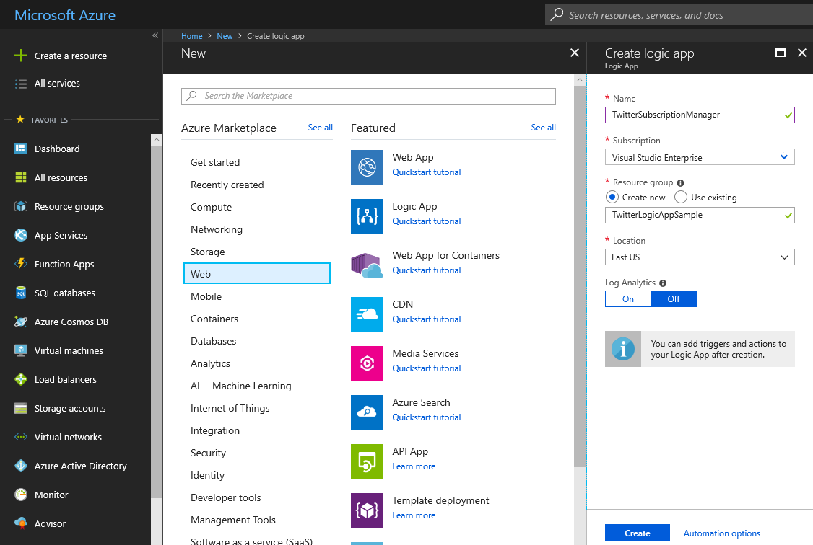

### Create a Logic App to monitor tweets and send notifications to subscribers
1. From the main Azure menu, choose **Create a resource** > **Web** > **Logic App**.
1. Provide details about your Logic App as shown here. 
After you're done, choose **Create**.

    | Property | Value | Description |
    |----------|-------|-------------|
    | **Name** | TwitterNotifier | The name for your Logic App | 
    | **Subscription** | <*your-Azure-subscription-name*> | The name for your Azure subscription |
    | **Resource group** | Use existing > TwitterLogicAppSample | Use the same resource group as the Logic App |
    | **Location** | East US | The region where your Logic App is hosted |
    | **Log Analytics** | Off | Keep the **Off** setting for diagnostic logging. |

    

### Create a Storage Account
1. From the main Azure menu, choose **Create a resource** > **Storage** > **Storage account - blob, file, table, queue**.
1. Provide details about your Storage Account as shown here. 
After you're done, choose **Create**.

    | Property | Value | Description |
    |----------|-------|-------------|
    | **Name** | <*your-name*>twitterdata | The name for your Storage Account | 
    | **Deployment model** | Resource manager | Use Resource Manager for new applications and for the latest Azure features |
    | **Account kind** | Storage (general purpose v1) | The type of storage account. V1 has everything we need but you can use V2 if you like. |
    | **Location** | East US | The region where your app's data is hosted |
    | **Replication** | Locally-redundant storage (LRS) | The least durable but lowest cost storage |
    | **Performance** | Standard | Standard storage accounts are backed by magnetic drives and provide the lowest cost per GB |
    | **Secure transfer required** | Enabled | There's no reason not to use HTTPS |
    | **Subscription** | <*your-Azure-subscription-name*> | The name for your Azure subscription |
    | **Resource group** | Use existing > TwitterLogicAppSample | Use the same resource group as the Logic App |
    | **Log Analytics** | Off | Keep the **Off** setting for diagnostic logging. |

    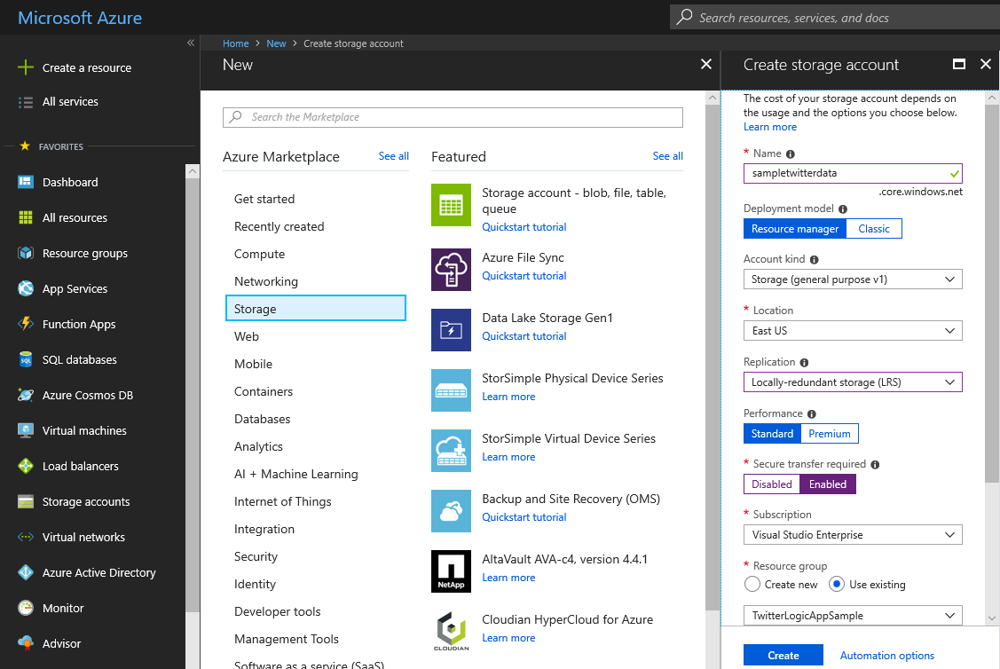

### Create a table in the storage account
Azure Table Storage will be used to persist data about subscribers and tweets between executions of the Logic App.
1. From the main Azure menu, choose **Resource groups** > **TwitterLogicAppSample**.
1. Choose the **<*your-name*>twitterdata** Storage Account that was created earlier.
1. The storage account overview will open. Under **Services** choose **Tables**.
1. Click the **+ Table** button at the top to add a new table named **subscriptions** and choose **OK**.

    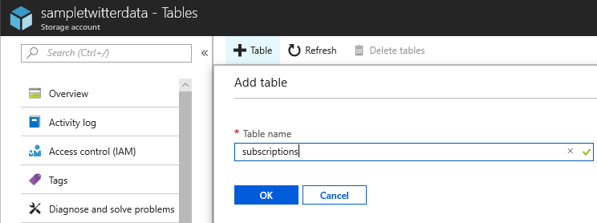

## Configure the TwitterSubscriptionManager Logic App
This Logic App will accept subscribe and unsubscribe requests from users to/from a Twitter search term of their choosing. It will also verify the request was intentional by sending a verification email to the user prior to honoring their request.

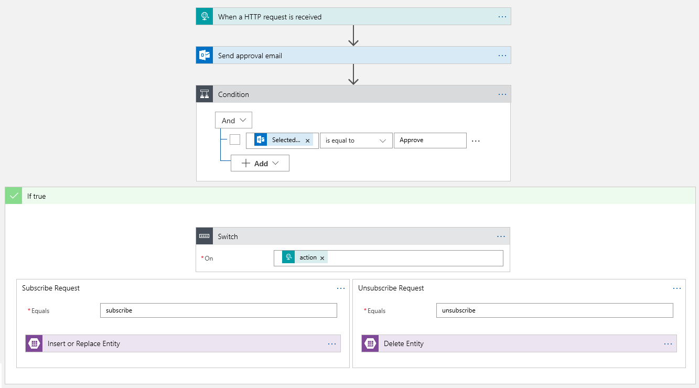

### Configure the trigger for the TwitterSubscriptionManager Logic App
Every Logic App must start with a trigger, which fires when a specific event happens or when a specific condition is met. Each time the trigger fires, the Logic Apps engine creates a Logic App instance that starts and runs your workflow.
1. From the main Azure menu, choose **Resource groups** > **TwitterLogicAppSample**.
1. Choose the **TwitterSubscriptionManager** Logic App that was created earlier.
1. The Logic Apps Designer will open and show a page with an introduction video and commonly used triggers. Under **Start with a common trigger**, choose **When a HTTP request is received**.
1. Use the **Save** button at the top of the screen to save the Logic App. Notice that a unique URL to trigger your Logic App was populated in the **HTTP POST URL** box. Your Logic App workflow will be triggered when a `POST` request is received at this URL.

    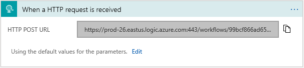

### Configure the parameters for the HTTP trigger
Your Logic App will need some information from the user to subscribe/unsubscribe them to/from a Twitter search term or hashtag. Namely, we'll need the email address of the subscriber, the search term, and whether the request is to subscribe or unsubscribe.
1. In the **When a HTTP request is received** trigger, click the **Edit** link next to **Using the default values for the parameters**. In the box that appears, we'll provide a JSON schema of the request format our Logic App should expect.
    1. Under the **Request Body JSON Schema** box, click the **Use sample payload to generate schema** link.
    1. In the **Enter or paste a sample JSON payload** dialog, paste the JSON below.
        ```json
        {
          "action": "subscribe",
          "email": "example@example.com",
          "term": "#microsoft"
        }
        ```
    1. Choose **Done**.

    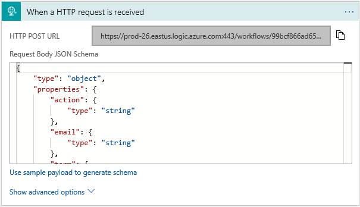

1. Save the Logic App.

### Send an approval email to validate the request
1. Choose **+ New step** in the Logic Apps Designer.
1. Under **Choose an action**, enter "send approval email" as your filter. From the actions list, select the **Send approval email** action for the email provider that you want.
    1. To filter the actions list to a specific app or service, you can select that app or service first:
        * For personal Microsoft accounts, select **Outlook.com**.
        * For Office 365 work or school accounts, select **Office 365 Outlook**.
        > The Gmail service does not support sending approval emails. If you only have a Gmail account, you can still use the **Send an email** action but your Logic App will not be able to receive responses to the email.
1. If asked for credentials, sign in to your email account so that Logic Apps can create a connection to your email account.

    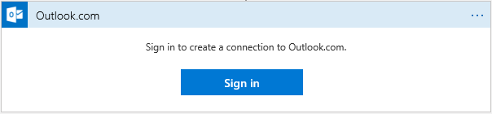

1. In the **Send approval email** action, specify the data that you want the email to include.
    1. Click inside the **To** box. The dynamic content dialog will appear. Choose **email** from the **Dynamic content** tab under the **When a HTTP request is received** heading. This will use the email address provided in the body of the HTTP request that triggered the workflow.
    1. If you like, edit the **Subject** of the email. You can include other parameters from the HTTP request using the dynamic content dialog. For example, you may want to change the subject to "Please approve <*action*> request for notifications about <*term*> tweets" where the <*action*> and <*term*> strings are replaced with the parameter values from the HTTP request.

    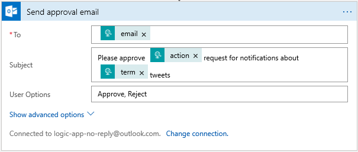

1. Save the Logic App.

### Check if the request was approved
After the approval email is sent, the Logic App will wait for the user to click either the "Approve" or "Reject" link in the email. Once the user clicks one of those links, the Logic App will need to determine what to do next based on the response.
1. Choose **+ New step** in the Logic Apps Designer.
1. Under **Choose an action**, enter "condition" as your filter. From the actions list, choose the **Condition** Control action.
1. In the **Condition** action, populate the tree of conditions to evaluate.
    1. Leave the **And** drop down as is.
    1. Click inside the **Choose a value** box. The dynamic content dialog will appear. Choose **SelectedOption** from the **Dynamic content** tab under the **Send approval email** heading.
    1. Leave the value of the **is equal to** condition unchanged.
    1. In the **Choose a value** box, enter **Approve**.

    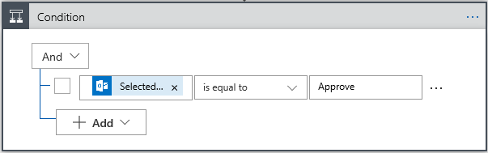

1. Save the Logic App.

### Check if the request was for subscribing or unsubscribing
Once the request is approved the Logic App will need to perform the requested action (subscribe or unsubscribe the user). In this step, we'll determine which action to perform.
1. Choose **Add an action** within the **If true** block below the **Condition** in the Logic Apps Designer.
1. Under **Choose an action**, enter "switch" as your filter. From the actions list, choose the **Switch** Control action.
1. In the **Switch** action, populate the **On** value to tell the control action what value should be used to determine the next step.
    1. Click inside the **On** box. The dynamic content dialog will appear. Choose **action** from the **Dynamic content** tab under the **When a HTTP request is received** heading.

    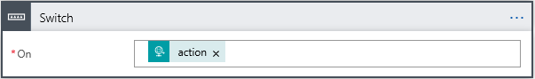

1. Below the **Switch** action, locate the **Case** block. Populate the **Equals** box with the text `subscribe`.
1. Click the **(+)** button between the **Case** block and the **Default** block. A **Case 2** block will be added.
1. Inside the **Case 2** block, populate the **Equals** box with the text `unsubscribe`.

    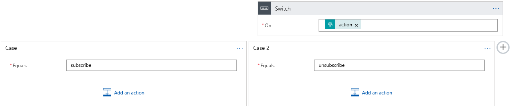

    > If you like, you can rename these case blocks using the **Rename** option within the **&middot;&middot;&middot;** menu of each block.
1. Save the Logic App.

### Add an entry to the subscriptions table if the request was to subscribe
1. Choose **Add an action** within the **Case** block containing "Equals subscribe."
1. Under **Choose an action**, enter "insert or replace" as your filter. From the actions list, choose the **Insert or Replace Entity** Azure Table Storage action.
1. In the **Insert or Replace Entity** action, specify the table and the entity to insert or replace.
    1. You may be prompted for a Storage Account connection
        1. In the **Connection Name** box, provide a name like **TwitterLogicAppStorage**.
        1. Choose the **Storage Account** created earlier, **<*your-name*>twitterdata**.
        1. Click **Create**.

        

    1. Once the connection is created, choose **subscriptions** from the **Table** drop down.
    1. Click inside the **Partition Key** box. The dynamic content dialog will appear. Switch to the **Expression** tab and enter `uriComponent(toLower(triggerBody()['email']))` into the expression box. Click **OK** to set the expression as the partition key value.
        > This expression converts the email field from the `POST` request to lower case and then [URI-encodes](https://en.wikipedia.org/wiki/Percent-encoding) it. Converting to lower case will ensure that the user can unsubscribe easily later without the need to use the exact casing as when they subscribed. The encoding is necessary in case the user enters a character that is not permitted in partition keys or row keys, such as `#`.
    1. Click inside the **Row Key** box. The dynamic content dialog will appear. Switch to the **Expression** tab and enter `uriComponent(toLower(triggerBody()['term']))` into the expression box. Click **OK** to set the expression as the row key value.
    1. In the **Entity** box, enter the JSON below.
        ```json
        {
          "LastTweetId": ""
        }
        ```
        > The `LastTweetId` property will be used to track the most recent tweet our Logic App found that matches the provided search term. It will simplify determining which tweets are "new" later.

    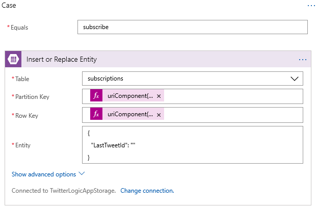

1. Save the Logic App.
    > You can read more about partition keys, row keys, and Azure Table Storage in general [here](https://docs.microsoft.com/azure/cosmos-db/table-storage-design-guide).

### Remove an entry from the subscriptions table if the request was to unsubscribe
1. Choose **Add an action** within the **Case 2** block containing "Equals unsubscribe."
1. Under **Choose an action**, enter "delete entity" as your filter. From the actions list, choose the **Delete Entity** Azure Table Storage action.
1. In the **Delete Entity** action, specify the table and the entity to delete.
    1. Choose **subscriptions** from the **Table** drop down.
    1. Click inside the **Partition Key** box. The dynamic content dialog will appear. Switch to the **Expression** tab and enter `uriComponent(toLower(triggerBody()['email']))` into the expression box. Click **OK** to set the expression as the partition key value.
    1. Click inside the **Row Key** box. The dynamic content dialog will appear. Switch to the **Expression** tab and enter `uriComponent(toLower(triggerBody()['term']))` into the expression box. Click **OK** to set the expression as the row key value.
    1. Leave the **ETag** box empty.

    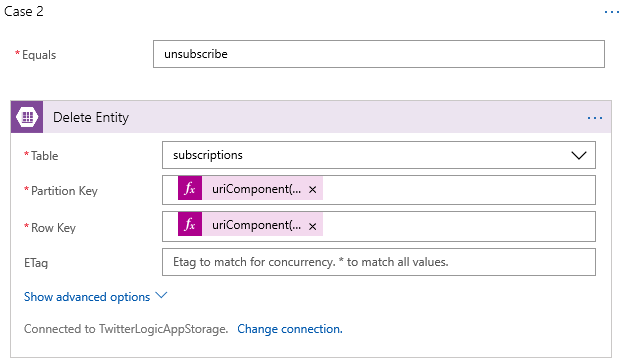

1. Save the Logic App.

### Test out the TwitterSubscriptionManager Logic App
Congratulations! The Logic App should now be ready for use. Let's test it out!
1. Save any outstanding changes made to the Logic App using the **Save** button at the top of the Logic Apps Designer.
1. Click the **When a HTTP request is received** trigger to expand it. Copy the value of the **HTTP POST URL** using the **Copy URL** button. Store this for later use.
1. Make a HTTP `POST` request to the URL copied in the last step.
    * On Windows, this can be done using a PowerShell command like this:
        ```PowerShell
        Invoke-RestMethod -Method Post -Body (@{ "action" = "subscribe"; "email" = "example@example.com"; "term" = "#azure" } | ConvertTo-Json) -ContentType "application/json" -Uri "the-url-of-your-logic-app"
        ```
    * On Mac/Linux/Windows Subsystem for Linux, this can be done using a cURL command like this:
        ```bash
        curl --request POST --data '{"action":"subscribe","email":"example@example.com","term":"logic apps"}' --header "Content-Type: application/json" "the-url-of-your-logic-app"
        ```
1. Close the Logic Apps Designer using the **X** in the top right corner of the blade.
1. Choose  **Refresh**  at the top of the Logic App overview blade.
1. Under the  **Run history** section of the Logic App overview blade, find the most recent run of the Logic App. Click its row to view a visualization of the executed workflow.

    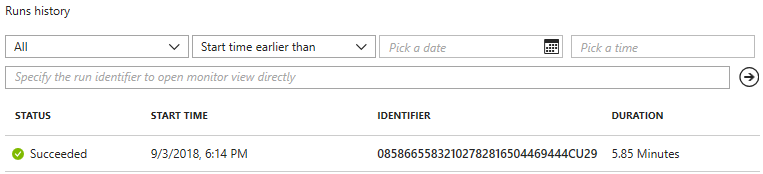

1. Optionally, use [Azure Storage Explorer](https://azure.microsoft.com/features/storage-explorer/) to browse to the <*your-name*>twitterdata Storage Account and verify an entity was added to the **subscriptions** table.

## Configure the TwitterNotifier Logic App
This Logic App will periodically query tweets from a [Twitter search API](https://developer.twitter.com/en/docs/tweets/search/api-reference/get-search-tweets.html) based on the subscriptions in the Azure Table and inform subscribers of new tweets via email.

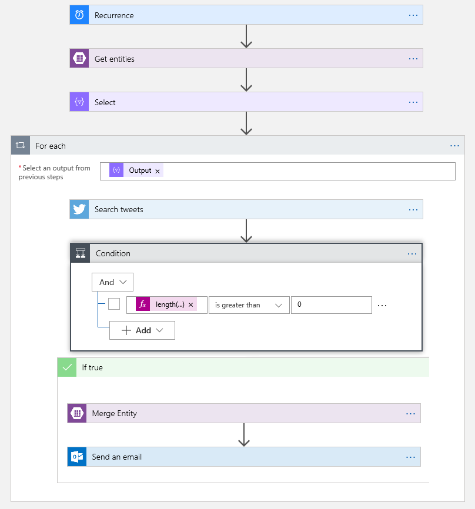

### Configure the trigger for the TwitterNotifier Logic App
This Logic App's trigger will be a recurrence, meaning the Logic App will execute itself automatically based on a configurable time interval.
1. From the main Azure menu, choose **Resource groups** > **TwitterLogicAppSample**.
1. Choose the **TwitterNotifier** Logic App that was created earlier.
1. The Logic Apps Designer will open and show a page 
with an introduction video and commonly used triggers. Under **Start with a common trigger**, choose **Recurrence**.
1. Keep the default recurrence frequency or update it if you like.

    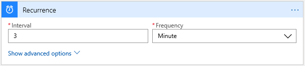

1. Use the **Save** button at the top of the screen to save the Logic App. If you chose a frequent interval for the Logic App, you may wish to return to the Logic App's overview blade and disable the Logic App until it is complete.

### Read subscriptions from the Table Storage
1. Choose **+ New step** in the Logic Apps Designer.
1. Under **Choose an action**, enter "get entities" as your filter. From the actions list, select the **Get entities** Azure Table Storage action.
1. In the **Get entities** action, specify the details of **subscriptions** table created earlier.
    1. You may be prompted for a Storage Account connection
        1. In the **Connection Name** box, provide a name like **TwitterLogicAppStorage**.
        1. Choose the **Storage Account** created earlier, **<*your-name*>twitterdata**.
        1. Click **Create**.
    1. Once the connection is created, choose **subscriptions** from the **Table** drop down.

    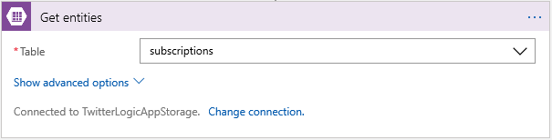

1. Save the Logic App.

### Select the subscription details from the entities
Next well map each Table Storage entity to an object with more convenient property names and URI-decoded versions of the partition key and row key.
1. Choose **+ New step** in the Logic Apps Designer.
1. Under **Choose an action**, enter "select" as your filter. From the actions list, choose the **Select** Data Operations action.
1. In the **Select** action, specify the properties to select from the table entities.
    1. Click inside the **From** box. The dynamic content dialog will appear. Choose **Get entities result List of Entities** from the **Dynamic content** tab.
    1. In the **Map** fields, enter the following mappings

        | Key | Value | Details |
        |-----|-------|---------|
        | **Email Encoded** | **Get entities result An entity Partition Key** | Choose this value from the **Dynamic content** tab |
        | **Search Term Encoded** | **Get entities result An entity Row Key** | Choose this value from the **Dynamic content** tab |
        | **Email** | `uriComponentToString(item()['PartitionKey'])` | Enter this value into the **Expression** tab of the **Dynamic content** dialog |
        | **Search Term** | `uriComponentToString(item()['RowKey'])` | Enter this value into the **Expression** tab of the **Dynamic content** dialog |
        | **Last Tweet ID** | `item()['LastTweetId']` | Enter this value into the **Expression** tab of the **Dynamic content** dialog |

        > The `item()` portion of the expression is a function that returns the item that is in the current iteration of a repeating action. It may be helpful to think of this as the element at the current index of a loop over an array.

    

1. Save the Logic App.

### Create a loop to iterate through the subscription objects
1. Choose **+ New step** in the Logic Apps Designer.
1. Under **Choose an action**, enter "for each" as your filter. From the actions list, choose the **For each** Control action.
1. In the **For each** action, specify the output of the **Select** action as the value for the **Select an output from previous steps** box. Click within the box and choose **Output** under the **Select** step header of the **Dynamic content** tab.

    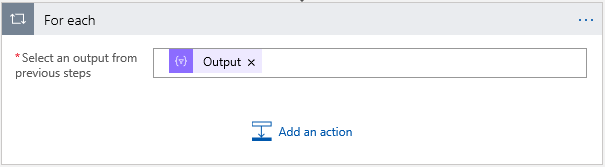

1. Save the Logic App.

### Get recent tweets from the Twitter "Search tweets" API
Twitter offers an API that provides the most recent tweets matching a search term (word, phrase, or hashtag). We'll query that API for each subscribed search term within our Logic App. The API is available as a [Microsoft Connector](https://docs.microsoft.com/connectors/). A connector is a proxy or a wrapper around an API that allows the underlying service to talk to Microsoft Flow, PowerApps, and Logic Apps. You can read more about the Twitter Connector [here](https://docs.microsoft.com/connectors/twitter/).
1. Choose **Add an action** within the **For each** loop in the Logic Apps Designer.
1. Under **Choose an action**, enter "search tweets" as your filter. From the actions list, choose the **Search tweets** Twitter action.
1. If asked for credentials, sign in to your Twitter account so that Logic Apps can create a connection and call the Twitter API.

    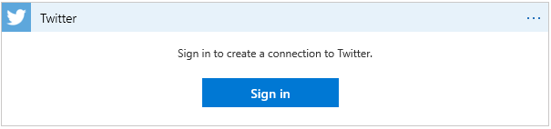

1. In the **Search tweets** action, specify the properties of the API request.
    1. Click within the **Search text** box. The dynamic content dialog will appear. Switch to the **Expression** tab and enter `item()['Search Term']` into the expression box. Click **OK** to save the expression.
    1. Click the **Show advanced options** link within the **Search tweets** action.
    1. If you wish, increase the **Maximum results** to 100.
    1. Click within the **sinceId** box. The dynamic content dialog will appear. Switch to the **Expression** tab and enter `item()['Last Tweet ID']` into the expression box. Click **OK** to save the expression.
        > This will ask the Twitter API to only return tweets that were created after the specified tweet ID.

    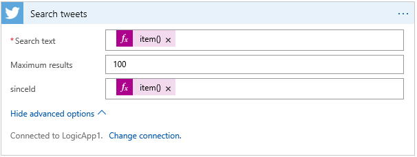

1. Save the Logic App.

### Check if there are new tweets matching the search term
We want to check if any new tweets matching the search term have been posted since the last time our Logic App executed. Since we asked the Twitter API to only return tweets since the last tweet ID our Logic App encountered, we can check the number of tweets returned by the API to determine if we should notify the subscriber of new tweets.
1. Choose **Add an action** within the **For each** loop in the Logic Apps Designer.
1. Under **Choose an action**, enter "condition" as your filter. From the actions list, choose the **Condition** Control action.
1. In the **Condition** action, populate the tree of conditions to evaluate.
    1. Leave the **And** drop down as is.
    1. Click inside the first **Choose a value** box. The dynamic content dialog will appear. Switch to the **Expression** tab and enter `length(body('Search_tweets'))` into the expression box. Click **OK** to save the expression.
        > This expression will return the number of tweets in the body of the Twitter API response.
    1. Change the value of the **is equal to** condition to **is greater than**.
    1. In the **Choose a value** box, enter **0**.

    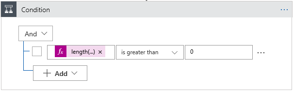

1. Save the Logic App.

### Update the Last Tweet ID for the subscription in Azure Table Storage
1. Choose **Add an action** within the **If true** block below the **Condition** in the Logic Apps Designer.
1. Under **Choose an action**, enter "merge entity" as your filter. From the actions list, choose the **Merge Entity** Azure Table Storage action.
1. In the **Merge Entity** action, specify the table entity to update.
    1. In the **Table** box, choose **subscriptions** from the drop down.
    1. Click inside the **Partition Key** box. The dynamic content dialog will appear. Switch to the **Expression** tab and enter `item()['Email Encoded']` into the expression box. Click **OK** to save the expression.
    1. Click inside the **Row Key** box. The dynamic content dialog will appear. Switch to the **Expression** tab and enter `item()['Search Term Encoded']` into the expression box. Click **OK** to save the expression.
    1. In the **Entity** box, enter the JSON template below.
        ```json
        {
          "LastTweetId": <id>
        }
        ```
        1. After populating the field, highlight the `<id>` portion of the field's value and delete it.
        1. With your cursor at the position where `<id>` used to be, click the **Expression** tab in the **Dynamic content** dialog.
        1. In the expression box, enter `first(body('Search_tweets'))['TweetId']` and choose **OK**. This will update the ID of the most recent tweet in the table entity.
    1. In the **ETag** box, enter __*__. This will update the table entity regardless of whether it has changed since we queried it.

    

1. Save the Logic App.

### Send a notification email if there are new tweets matching the subscribed term
1. Choose **Add an action** within the **If true** block below the **Merge Entity** action in the Logic Apps Designer.
1. Under **Choose an action**, enter "send an email" as your filter. From the actions list, select the **Send an email** action for the email provider that you want.
    1. To filter the actions list to a specific app or service, you can select that app or service first:
        * For personal Microsoft accounts, select **Outlook.com**.
        * For Office 365 work or school accounts, select **Office 365 Outlook**.
        * For personal Google accounts, select **Gmail**.
1. If asked for credentials, sign in to your email account so that Logic Apps can create a connection to your email account.
1. In the **Send an email** action, specify the data that you want the email to include.
    1. Click inside the **To** box. The dynamic content dialog will appear. Switch to the **Expression** tab and enter `item()['Email']` into the expression box. Click **OK** to save the expression.
    1. In the **Subject** box, enter the value `<number> new tweets matching <term>`.
        1. After populating the field, highlight the `<number>` portion of the field's value and delete it.
        1. With your cursor at the position where `<number>` used to be, click the **Expression** tab in the **Dynamic content** dialog.
        1. In the expression box, enter `length(body('Search_tweets'))` and choose **OK**. This will insert the number of new tweets into the subject at the correct position.
        1. Now highlight the `<term>` portion of the field's value and delete it.
        1. With your cursor at the position where `<term>` used to be, click the **Expression** tab in the **Dynamic content** dialog.
        1. In the expression box, enter `item()['Search Term']` and choose **OK**. This will insert the subscribed search term into the subject at the correct position.
        > **OPTIONAL** To be grammatically correct, we should make the word "tweets" singular if the number of new tweets is 1. If you like, replace the word "tweets" with this expression: `if(equals(length(body('Search_tweets')), 1), 'Tweet', 'Tweets')`.
    1. In the **Body** box, enter any value you like. If you don't want to include anything, just enter a space.
        1. If you would like to include the content of the most recent tweet, click within the **Body** box and enter any explanatory text along with the expression `first(body('Search_tweets'))['TweetText']` via the dynamic content dialog.
            > If you would like to include other properties of the most recent tweet in the email body, refer to the [list of property paths available in the TweetModel](https://docs.microsoft.com/connectors/twitter/#tweetmodel). Simply replace `TweetText` in the expression with one of the other property paths, such as `TweetedBy`.

    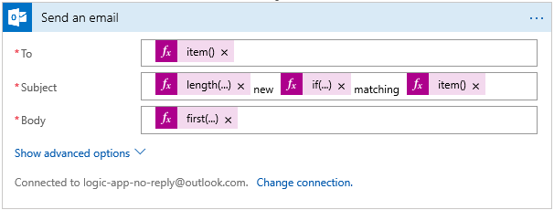

1. Save the Logic App.

### Test out the TwitterNotifier Logic App
Congratulations! The Logic App should now be ready for use. Let's test it out!
1. Save any outstanding changes made to the Logic App using the **Save** button at the top of the Logic Apps Designer.
1. Close the Logic Apps Designer using the **X** in the top right corner of the blade.
1. If you previously disabled the Logic App while creating it, click the **Enable** button at the top of the Logic App overview blade.
1. Once the Logic App is enabled, choose  **Run Trigger** > **Recurrence**  at the top of the Logic App overview blade.
    > Alternatively, wait for the recurrence trigger to fire as scheduled.
1. Choose  **Refresh**  at the top of the Logic App overview blade.
1. Under the  **Run history** section of the Logic App overview blade, find the most recent run of the Logic App. Click its row to view a visualization of the executed workflow.

    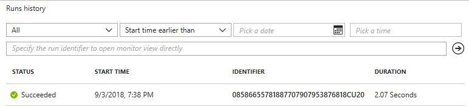
